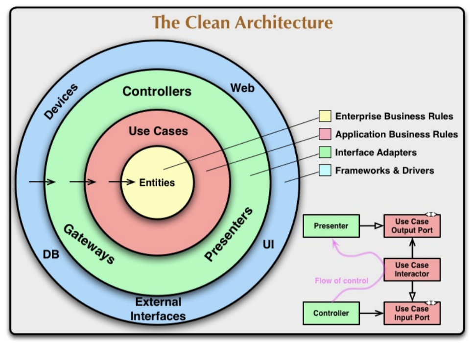
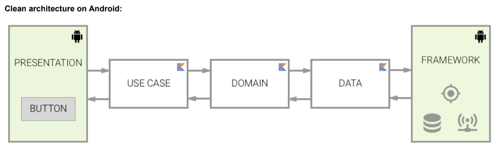

# Zendesk-Ticket-Viewer
Zendesk Ticket Viewer - A CLI ticket viewer for the Zendesk Intern Coding Challenge
written by Vinay Kumar

## Installation & Compiling & Running (Mac / Unix command line)

### CHECKING JAVA IS INSTALLED
Ensure that Java and Java C are installed on the machine
(You will require jre1.8.0_65 or greater)
You can check the current version of Java installed by typing:
java -version
And you can check the current Java C version installed by typing:
which javac

### IF YOU DO NOT HAVE JAVA/JAVAC INSTALLED
1. Go to http://www.oracle.com/technetwork/java/javase/downloads/jdk8-downloads-2133151.html
   and download and install a relevant version for your operating system
2. Set the CLASSPATH of your newly installed Java by following steps here
   https://docs.oracle.com/javase/tutorial/essential/environment/paths.html
   relative to your operating system.

### COMPILING THE PROGRAM
1. Navigate to the extracted project directory, where you should see folders like src, libs, ect
2. compile the jars and java file :-    
   javac -d bin -sourcepath src -cp "libs/*"  src/com/company/Main.java
3. Run the main class :-        
   java -cp bin:"libs/*" com.company.Main

## Requirements

### Functional Requirements
1) Connect to the Zendesk API  
2) Request all the tickets for your account.  
3) Display them in a list.  
4) Display individual ticket details.  
5) Page through tickets when more than 25 are returned.

### Non-Functional Requirements
1) The amount of data you display in the ticket list view and the single ticket view is up to
you.  
2) How you format and display the ticket data is up to you, just ensure it is easy to read.  
3) The Ticket Viewer should handle the API being unavailable.   
4) We need to see you write some unit tests for your application in a standard unit testing
framework for your language of choice.

## Architecture

### Clean Architecture
Clean architecture provides guidelines for organising the different units of code with its dependency rule. Other architectures (MVC/MVP/MVVM) focus on
separating the Android View dependencies but in reality we do consume other elements provided by Android framework such as SQLite Database,
Content Providers, Content observers, Shared Preferences. Introducing these elements into our domain rules would make it tightly coupled to the
framework and not portable to other platforms. We end up reinventing the wheel again for other platforms. Clean architecture solves this problem by
arranging the dependencies into concentric circles(as shown above). It also helps to develop business rules independent of framework, more testable
codebase, adaptive to data storage decisions(changing db) and robust to UX changes. These guidelines provides a path for achieving the design goals of
TicketViewer application.

## Future Scope
- Run tickets fetching task(through api's) in background IO thread.
- Better testing, simulating user input and mocks.